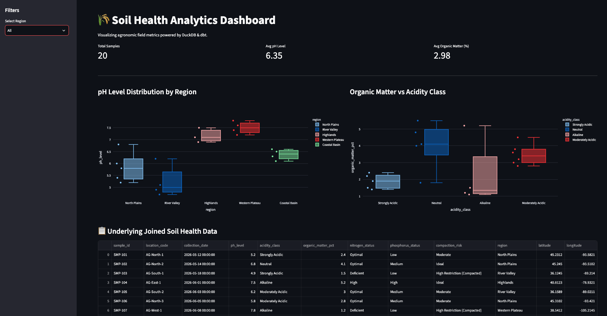
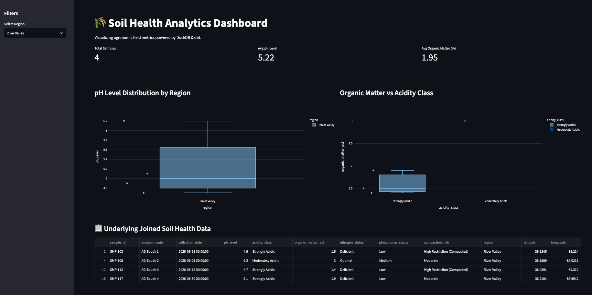

# 🌾 Soil Health Analytics Engineering Pipeline

I architected an end-to-end modern data stack project designed to transform raw agronomic field measurements into clean, tested data marts and interactive visual soil health monitoring dashboards. Follow, Subscribe & DM me at https://x.com/dirkjbosman or https://www.linkedin.com/in/dirkjbosman/.


## 🌟 Why This Project?
Agricultural data is often trapped in fragmented spreadsheets, making it difficult to assess soil compaction, acidity, and nutrient levels rapidly. This project demonstrates how modern analytics engineering tools can be combined to build a lightweight, high-performance local data warehouse pipeline without the overhead of expensive cloud infrastructure.

* **Business Value:** Empowers agricultural analysts and agronomists to instantly isolate nutrient-deficient regions, track soil acidity trends, and monitor physical compaction risks.
* **Target Audience:** Particularly valuable for agricultural researchers, data engineers and analytics professionals looking for a modular, reproducible local template using **dbt** and **DuckDB**.

---

## 🛠️ Tech Stack
* **Transformation:** [dbt (Data Build Tool)](https://www.getdbt.com/)
* **Database & Compute:** [DuckDB](https://duckdb.org/) (Embedded high-performance OLAP)
* **Package/Env Manager:** [Astral uv](https://github.com/astral-sh/uv)
* **Visualization Layer:** [Streamlit](https://streamlit.io/) & [Plotly](https://plotly.com/)

---

## 📂 Project Structure

The rough project structure looks as follows:

```text
dbt-soil-analytics/
├── data/
│   └── raw_soil_samples.csv       # Raw field sample inputs (100 records)
├── models/
│   ├── marts/                     # Business-ready analytics tables
│   │   ├── dim_soil_locations.sql
│   │   └── fct_soil_health_metrics.sql
│   ├── staging/                   # Cleaned and standardized views
│   │   ├── src_soil.yml
│   │   └── stg_soil_samples.sql
│   └── schema.yml                 # Data quality test assertions
├── app.py                         # Streamlit interactive dashboard script
├── dbt_project.yml                # dbt configuration
├── profiles.yml                   # DuckDB local adapter settings
└── pyproject.toml                 # Python project dependencies
```

---

## 📊 Dashboard Reporting Explainer

The interactive Streamlit dashboard provides two core analytical views:

1. **pH Level Distribution by Region (Box Plot):** Displays the statistical spread, median, and outlier pH metrics across various agricultural regions (e.g., North Plains, River Valley, Highlands), allowing teams to quickly identify overly acidic or alkaline zones.
2. **Organic Matter vs. Acidity Class (Distribution & Scatter):** Cross-references soil organic matter percentages against classified acidity tiers to evaluate biological fertility alongside chemical composition.

### Dashboard Previews

**Full Regional Overview:**


**Filtered Region View (River Valley):**


---

## 🚀 Quickstart Guide

### 1. Clone and Setup Environment
```bash
git clone [https://github.com/](https://github.com/)<your-username>/dbt-soil-analytics.git
cd dbt-soil-analytics
```

# Install dependencies via uv
```bash
uv init --app --no-readme || true
uv add dbt-duckdb duckdb streamlit plotly
```

### 2. Run dbt Transformations & Data Quality Tests
Execute the pipeline to read raw soil metrics, clean formats, and build analytical marts into DuckDB:
```bash
uv run dbt run --profiles-dir .
uv run dbt test --profiles-dir .
```

### 3. Launch the Interactive Dashboard
Spin up the local Streamlit web application:
```bash
uv run streamlit run app.py
```
Open http://localhost:8501 in your browser to interact with regional filters and inspect the underlying data marts.


### 4. Future Roadmap & Room for Expansion
- Geospatial Analytics (DuckDB Spatial Extension): Implement spatial polygons to map exact soil sample coordinates against local weather and topography datasets.
- Automated CI/CD Workflows: Introduce GitHub Actions to run automated dbt test assertions on every pull request.
- Advanced Statistical Expectations: Expand data quality assertions using dbt-expectations to automatically flag seasonal standard deviation drifts in soil chemistry.
- Incremental Transformations: Refactor fact tables to leverage incremental materialization strategies for high-frequency IoT sensor data streams.


